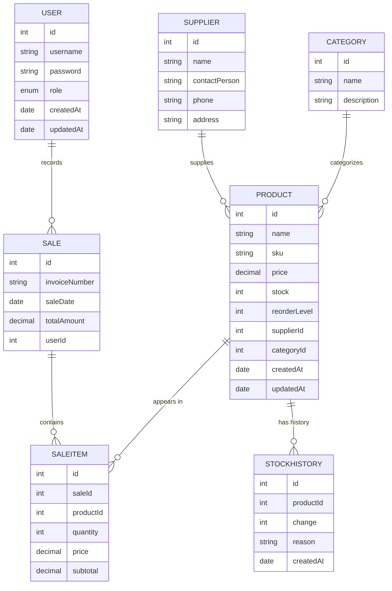

# 🧱 Inventory Management System (TypeORM + Express + PostgreSQL)

A modular and scalable inventory & POS system built using **TypeORM**, **Express**, and **PostgreSQL**, containerized with **Docker**.  
It demonstrates how to structure entities, relationships, and CRUD operations in a clean TypeORM project.

---

## ⚙️ Tech Stack

- **Node.js / Express** – Web framework
- **TypeScript** – Static typing
- **TypeORM** – ORM for database entities & relations
- **PostgreSQL** – Primary database
- **Docker + Docker Compose** – Containerized runtime
- **dotenv** – Environment variable management

---

## 🧩 Core Entities

| #   | Entity                    | Purpose                          | Key Relationships                                                          |
| --- | ------------------------- | -------------------------------- | -------------------------------------------------------------------------- |
| 1   | **User**                  | Handles authentication and roles | One-to-Many with `Sale`                                                    |
| 2   | **Supplier**              | Stores supplier details          | One-to-Many with `Product`                                                 |
| 3   | **Product**               | Core inventory item              | Many-to-One `Supplier`, One-to-Many `SaleItem`, One-to-Many `StockHistory` |
| 4   | **Sale**                  | Represents a transaction         | Many-to-One `User`, One-to-Many `SaleItem`                                 |
| 5   | **SaleItem**              | Line item within a sale          | Many-to-One `Sale` and `Product`                                           |
| 6   | **StockHistory**          | Logs stock movements             | Many-to-One `Product`                                                      |
| 7   | **Category** _(optional)_ | Groups products                  | One-to-Many `Product`                                                      |

---

## 🗃️ Entity Relationship Diagram (ERD)

